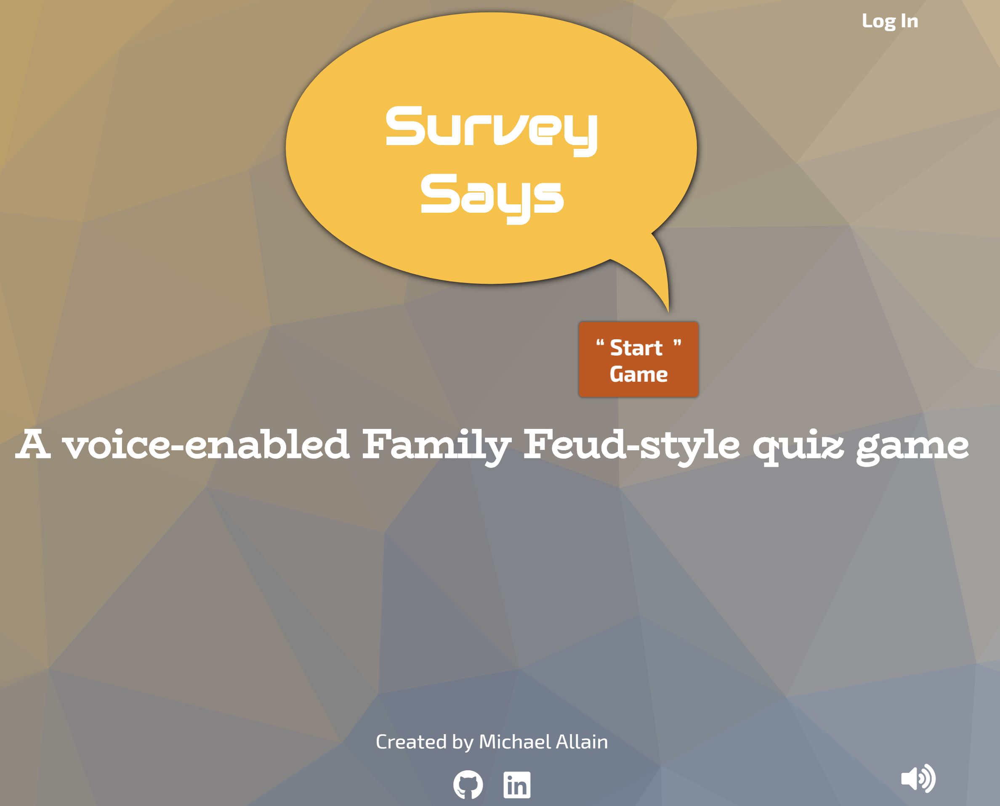
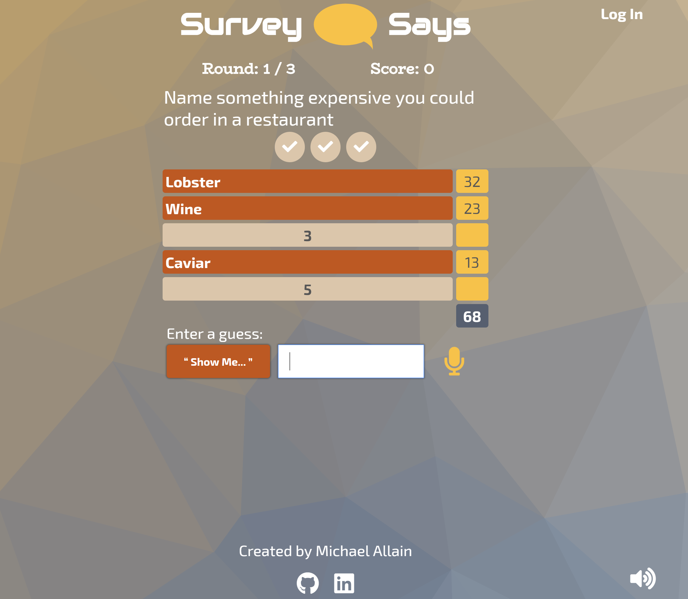
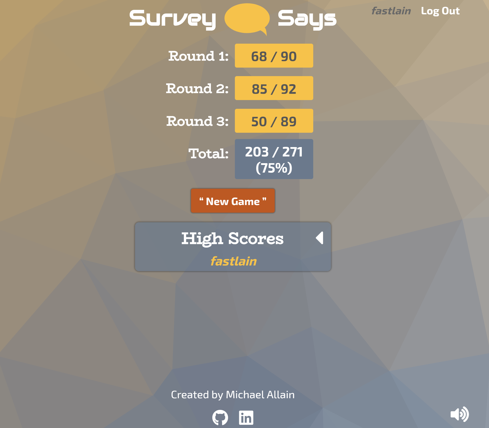
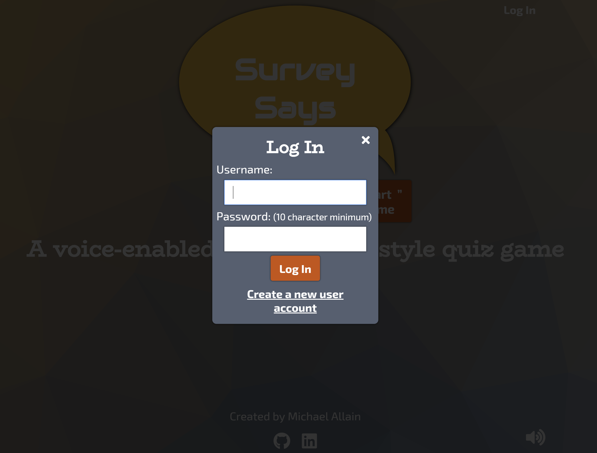

# Survey Says

A voice-enabled Family Feud-style quiz game

### **_[Live link](https://surveysaysgame.herokuapp.com/)_**
  * NOTE: Speech recongition uses an [experimental API](https://developer.mozilla.org/en-US/docs/Web/API/Web_Speech_API) and is currently only supported on **Google Chrome** on desktops

## Introduction

Speech recognition is an exciting technology making its way into every area of software and hardware development. Survey Says uses the experimental "Web Speech API" to introduce voice-to-text to a fun and light-hearted game. Based on the ever-popular [Family Feud](https://www.familyfeud.com/) game show, this responsive full-stack web application also incorporates user authentication, continuous integration & testing, and a database for storing questions/answers and user data.  

## Screenshots
#### Start screen:

#### Game in-progress:

#### Results screen:

#### Log In screen:

## Prerequisites
* You will need these programs installed to run Survey Says locally
    * [Git](https://git-scm.com/)
    * [Node.js](https://nodejs.org/en/)
    * [npm](https://www.npmjs.com/)
    * [MongoDB](https://www.mongodb.com/)
  
## Installation
* Clone this repository:
    * `git clone https://github.com/fastlain/SurveySays.git`
* Move into folder:
    * `cd SurveySays/`
* Run npm install:
    * `npm install`

## Run Program
* Start MongoDB local server
    * `mongod`
* Run npm start
    * `npm start`
* In browser, navigate to `localhost:8080`

## Test
* Start MongoDB local server
    * `mongod`
* Run npm test
    * `npm test`

## Creating new questions and answers
* First, create a user account in the Survey Says game
* To create questions, you must have admin access:
    * To grant this, you'll need access to edit your local Mongo database
    * Find your user account in the `users` collection and change the admin property from false to true
* Navigate to localhost:8080/dataentry.html, login to your account, and follow the prompts to create new entries

## Technology

### Front End
* HTML5
* CSS3
* JavaScript (ES6)

* JavaScript Libraries
    * [jQuery](http://jquery.com/)
    * [annyang](https://www.talater.com/annyang/)
        * Annyang is a small Speech Recognition library built for use with the experimental [Web Speech API](https://developer.mozilla.org/en-US/docs/Web/API/Web_Speech_API)

### Back End
* [Node](https://nodejs.org/en/) and [Express](https://expressjs.com/)
    * [Passport](http://www.passportjs.org/) authentication
    * [Mocha](https://mochajs.org/) test framework and [Chai](http://www.chaijs.com/) assertion library
    * [Mongoose](http://mongoosejs.com/) for MongoDB object modeling
* [MongoDB](https://www.mongodb.com/)
    * NoSQL (document-based) database
    * Hosted on the cloud with [mLab](https://mlab.com/)

### Production
* [Travis](https://travis-ci.org/) Continuous Integration
* [Heroku](https://www.heroku.com/) Cloud Application Platform

## Future Features
* Multiplayer
* Global High Scores
* Speech synthesis (game talks to you!)
* Increased robustness of answer matching (e.g. common misspellings and mispronunciations)
* User performance feedback (e.g. graph of scores over time, achievements/badges, etc.)